# Paper Share 20240315

## Aligning Crowd Feedback via Distributional Preference Reward Modeling [[paper](https://arxiv.org/pdf/2402.09764.pdf)]

*Dexun Li, Cong Zhang, Kuicai Dong, Derrick Goh Xin Deik, Ruiming Tang, Yong Liu*

Huawei Noah’s Ark Lab

### Problem
  1. Limited representation
  2. Evolving preferences
   

    
   

### Method
 1. human preference distrbution, beta distribution
 
    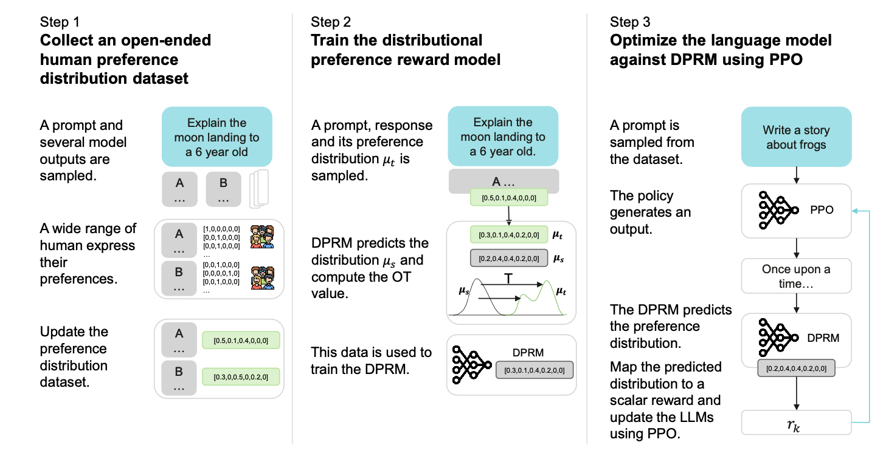

    A,B,... are generated from one comercial LLM with various simulated personas.`

    

    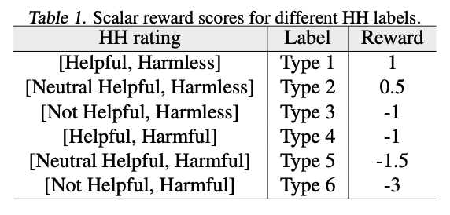
    

    * Prior Distribution: $LLM_{API}$ directly outputs a distribution that captures a wide range of human perspectives.
    * Posterior Distribution: $LLM_{API}$ is instructed to emulate different human personas like "rigorous scientists", "impulsive teens", "eccentric artists", etc, and articulate their perfrences by selecting one of the six categories.
    * Label Smoothing: on posterior distriubtion, tempers absolute certainty by adjusting them towards near certainty with a marginal probability allocated to the next most likely label.

1. a novel reward model framework, Distributional Preference RM (DPRM)

   * Previously, use binary ranking label (chosen & rejected) for RM.
   * A direct idea is to use cross-entropy loss on the distributions:
   

   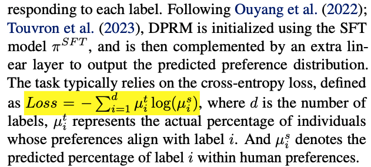
   

   * However, such an idea results in equal distance between $[0.9, 0.1, 0, 0, 0, 0]$ with $[0.9, 0, 0.1, 0, 0, 0]$ or $[0.9, 0, 0, 0, 0, 0.1]$.
   * Need a ranking loss! Use optimal transport loss, which recognizes **geometry of label space**.
  
### Experiments
   1. Baselines
   

   
   

   2. Comparison results:
   

     
   

---

## Direct Preference Optimization: Your Language Model is Secretly a Reward Model [[paper](https://proceedings.neurips.cc/paper_files/paper/2023/file/a85b405ed65c6477a4fe8302b5e06ce7-Paper-Conference.pdf)]

*Rafael Rafailov, Archit Sharma, Eric Mitchell, Stefano Ermon, Christopher D. Manning, Chelsea Finn*

Stanford University, Chan Zuckerberg Biohub

### Problem

   1. RLHF is a **complex** and often **unstable** procedure, first fitting a reward model that reflects the human preferences, and then fine-tuning the large unsupervised LM using reinforcement learning to maximize this estimated reward without drifting too far from the original model.
    
   

     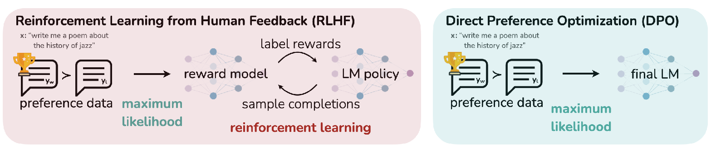
   

### Method
   * Deriving the DPO objective

      RL Fine-Tuning Phase:

      $max_{\pi_\theta} \mathbb{E}_{x\sim\mathcal{D}, y\sim\pi_{\theta}(y|x)}[r_\phi(x, y) - \beta\mathbb{D}_{\text{KL}[\pi_\theta(y|x)||\pi_{\text{ref}}(y|x)]}]$

      The optimal solution of KL-constrained reward maximization objective: :paperclip:

      

        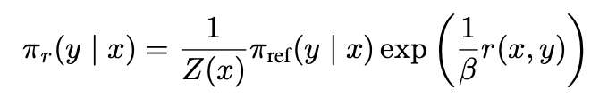
      

      $Z(x)$ is a partition function, which is hard to estimate. :paperclip:

      This makes it hard to utilize in practice.
      Take the logarithm of both sides, we have: :writing_hand:
      

        
      

      Recall Bradley-Terry model: :paperclip:
      

        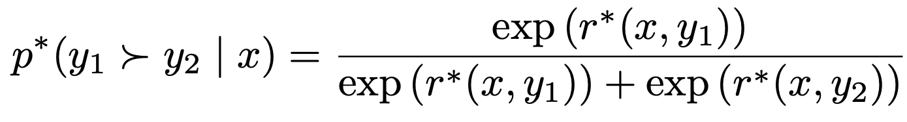
      

      Substituting the reparameterized $r(x,y)$ into BT model, the optimal RLHF policy $\pi^*$ satisfy the preference model: :writing_hand:
      

      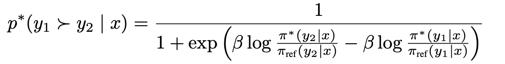
      

      Now we have the probability of human preference data interms of the optimal policy rather than the reward model. To solve it, formualting a maximum likelihood objective for $\pi_\theta$:
      

      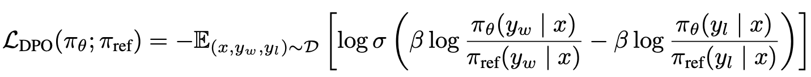
      

      The gradient with respect to $\theta$:
      

      
      

      where 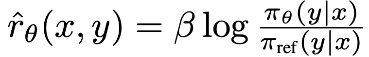, 
      
      is the reward implicitly defined by the language model $\pi_\theta$ and reference model $\pi_{\text{ref}}$.

   * Utilization
      1. Sample $y_1, y_2 \sim \pi_{\text{ref}}(.| x)$ for every prompt $x$, label them with human preferences.
      2. Optimize $\pi_{\theta}$ to minimize $\mathcal{L}_{\text{DPO}}$.
      

---

## Yi: Open Foundation Models by 01.AI [[paper](https://arxiv.org/pdf/2403.04652.pdf)]

*01.AI*

*Published on 2024-03-07*

### Highlight

Model Scale Comparison:
| Model Name | Model Scale |
|------------|-------------|
| Yi-34B     | 34B         |
| Chinchilla | 70B         |
| LLaMA      | 70B         |

<mark>Since model scale is relative smaller, Yi uses a larger pretrain dataset (3.1T tokens) so that the **compute flops** can be compensated. (Chinchilla optimal regime, model-data scale balance [[paper](https://arxiv.org/pdf/2203.15556.pdf)])</mark> :paperclip:

Pretraining data cleaning system
| Pipeline      | Related Keywords                                                               |
|---------------|--------------------------------------------------------------------------------|
| Filtering     | language, heuristic textual features, perplexity, semantics, topic, and safety |
| Deduplication | paragraph, MinHash, and exact matching                                         |

<mark> For Youling crowdsourcing platform, shall we consider to make the above methods more frameworked. </mark>

Yi Data Clearning Framework:

     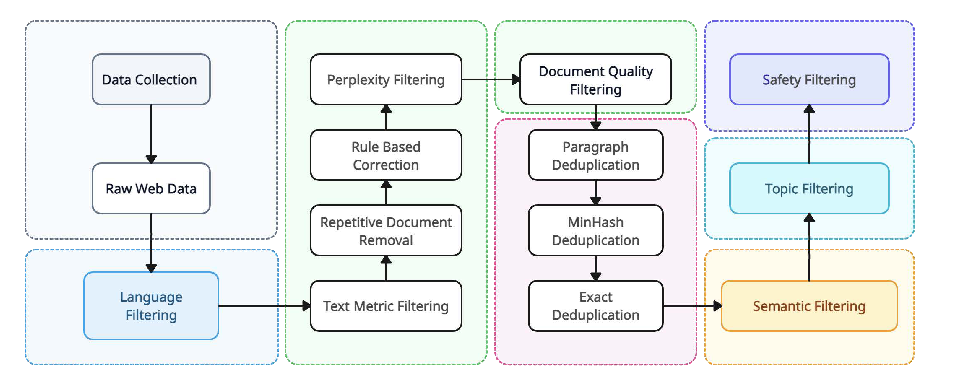

A glance on the infra work:

     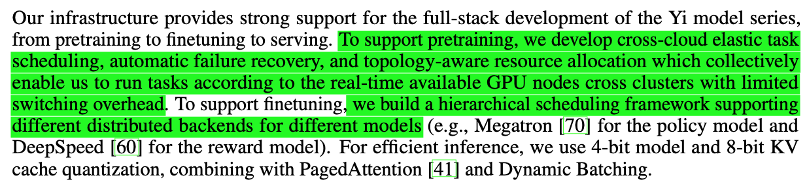

### Pretraining

#### Data Processing

Yi's pretraining data mixture:

     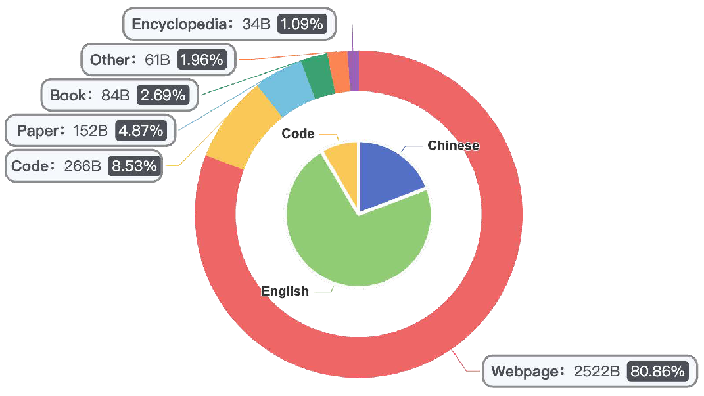

   
   1. Heuristic Rule Filters
      * URL, domain, word blocklists and garbled text filters.
      * Document length, the ratio of special symbols, and the ratio of short, consecutive, or incomplete lines.
      * Repeated words, n-grams, or paragraphs.
      * Identify and anonymize Personal Identifiable Information (PII), such as email addresses and phone numbers.
  
   2. Learned Filters
      
      

        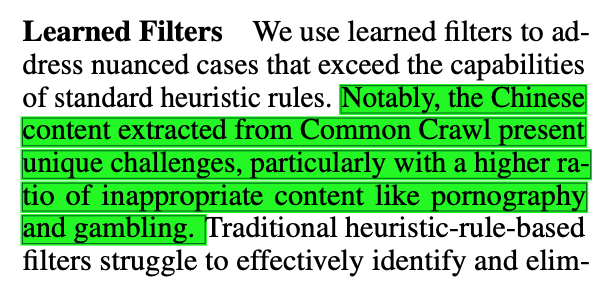
      

      * Perplexity Scorer, evaluates a vast array of web documents, discarding those with perplexity scores
      largely above average. **---based on CCNet** :paperclip:
      * Quality Scorer is a classifier trained to recognize and favor pages similar to Wikipedia in quality and assign scores accordingly. **---based on a trained classifier** :paperclip:
      * Document Coherence Scorer, identifies low-quality web documents that consist of disparate sentences or paragraphs, thus being incoherence. 
      * Safety Scorer identifies and removes web documents containing toxic content, such as violence, pornography, and political propaganda.
   3. Cluster-based Filters :writing_hand:
      

        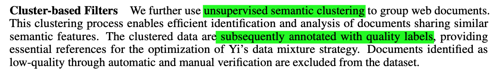
      

   4. Deduplication :paperclip:
      

        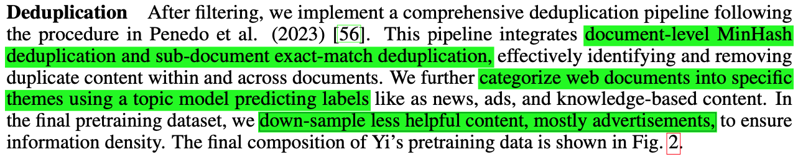
      

#### Tokenization :paperclip:

   

     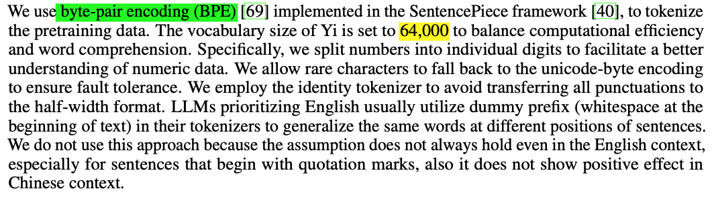
   

   * numbers into individual digits
   * allow handling on rare characters
   * employ the identity tokenizer
   * In LLMs prioritizing English, utilize dummy prefix in their tokenizers to generalize the same words at different positions. In Yi models, such utilization is dismissed

#### Model Architecture

Architectures for different Yi variations:
| Module                                | Model Size  | Differences               |
|---------------------------------------|-------------|---------------------------|
| Attention Mechanism                   | LLaMA-2-70B | Grouped-Query Attention   |
|                                       | LLaMA-2-7B  | full attention            |
|                                       | LLaMA-2-13B | full attention            |
|                                       | Yi-6B       | Grouped-Query Attention   |
|                                       | Yi-34B      | Grouped-Query Attention   |
| Activation Function                   | Yi-6B       | SwiGLU                    |
|                                       | Yi-34B      | SwiGLU                    |
| Positional Embedding and Long Context | Yi-6B       | Rotary Position Embedding |
|                                       | Yi-34B      | Rotary Position Embedding |

### Finetuning

<mark>An important insight: Finetuning method significantly emphasizes data quality over quantity. </mark>

   

     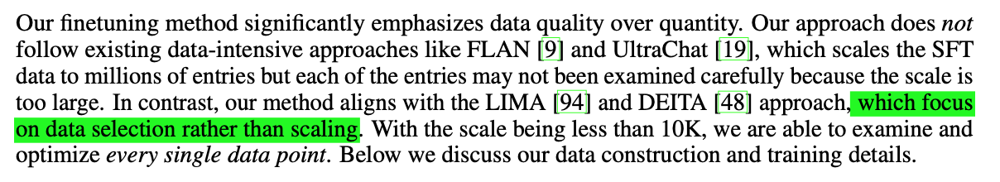
   

#### Data processing
   1. **Quality is all you need**
   
   | Model       | Finetuning dataset scale |
   |-------------|--------------------------|
   | Yi          | less than 10K            |
   | open-source | several hundred thousand |

   * prompt distribution: develope compound instructions and progressively evolved them to increase their complexity. **---based on WizardLM** :paperclip:
   * response formatting: the responses are structured in an introduction-body-conclusion format where the body is usually a list of bullet point. **---based on LIMA** :paperclip:
   * chain-of-thought data formatting: performing abstraction to formulate higher-level solutions before delving into reasoning about the original, more concrete questions. **---based on “Step-Back” pattern in paper Zheng et al.** :paperclip:
   * hallucination: examine and ensure that the knowledge in the responses is not contained within the model, and eliminate responses that might lead to memorization. :question:
   * repetition: **rewrite** the repetitive turns of the responses that usually exist but may be overlooked in the finetuning dats :writing_hand:
   
   2. **Diversity and Mixture**
   * Ensure  the **coverage of different capabilities**: a wide spectrum of open-source prompt, encompassing areas such as *question answering, creative writing, dialogue, reasoning, mathematics, coding, safety, bilingual capabilities, and others.* :writing_hand:
   * Ensure **fine-grained control of different directions of capabilities**: develop a instruction tagging system. **---based on InsTag** :paperclip:
   * Achieve **the optimal data ratio for balancing different directions of the capability**: an approximate grid search to determine our data mixture. **---based on Dong et al.** :paperclip:
   
   3. ChatML Format
   
   * Format of the data substantially influences the model's ultimate performance: need structured data. **---based on ChatML style format**

#### Training Method

   | Parameters          | Value                      |
   |---------------------|----------------------------|
   | Optimizer           | AdamW                      |
   | $\beta_1$           | 0.9                        |
   | $\beta_2$           | 0.999                      |
   | $\epsilon$          | $10^{-8}$                  |
   | Sequence Length     | 4096                       |
   | Batch Size          | 64                         |
   | Training Step       | 300                        |
   | Learning Rate       | $1 \times 10^{-5}$         |
   | Weight Decay        | $0.1$                      |
   | Gradient Clipping   | maximum threshold $1.0$    |
   | NEFTune noise scale | 45 for Yi-34B, 5 for Yi-6B |

### Infrastructure

   

     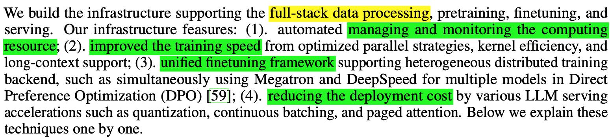
   

   1. Computing Resources Management
   * Manage training tasks of different priorities cross multiple cloud :writing_hand:
   * Elastic GPU utilization strategy :writing_hand:
   * Failure handling :writing_hand:
     * automated inspection, prediction, and labeling of nodes for different kinds of error categories;
     * safely remove failure nodes from resource pool
     * task queuing system with pre-checks
     * a user-friendly console, showing training tasks, hyper-parameters, and so on
  
   2. Performance and Cost Efficiency 
   
      <mark> *Memory* and *communication* restrictions are the two major technical challenges of large scale model training requiring integrated solutions **beyond adding more GPUs**. </mark>
    
   * **ZeRO-1** :paperclip:
   * **tensor parallel** :paperclip:
   * **kernel fusion** :paperclip:
   * topology-aware resource allocation :writing_hand:
   
   3. Finetuning Framework 
   
      <mark>Different from pretraining, finetuning LLMs may require the **orchestration of multiple models**, as is the practice of DPO and PPO.</mark> :writing_hand:

   4. Fast and Efficient Inference

      Primarily quantization, dynamic batching, and Paged Attention for improving decoding speed and memory usage.
      * 4-bit model quantization :paperclip:
      * 8-bit KV cache quantization :paperclip:
      * dynamic batching :paperclip:
      * pagedattention :paperclip:
   
   5. Long-context Window Support

      

        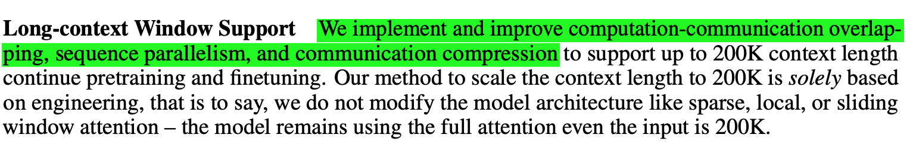
      

### Safety

   

     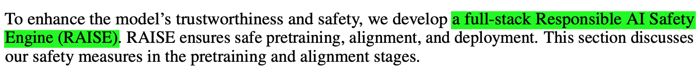
   

   1. Safety in Pretraining
   
      heuristic rules, keyword matching, and learned classifiers to remove text containing personal identifiers and private data, and reduce sexual, violent, and extremist content. **---based on existed data safety practices** :paperclip:

   2. Safety in Alignment

   * A comprehensive safety taxonomy :paperclip:
   
### Evaluation

#### Main Results

   1. Commonsense Reasoning :paperclip:
   2. Reading Comprehension :paperclip:
   3. Math :paperclip:
   4. Code :paperclip:
   5. Popular Aggregated Benchmark :paperclip:

   

     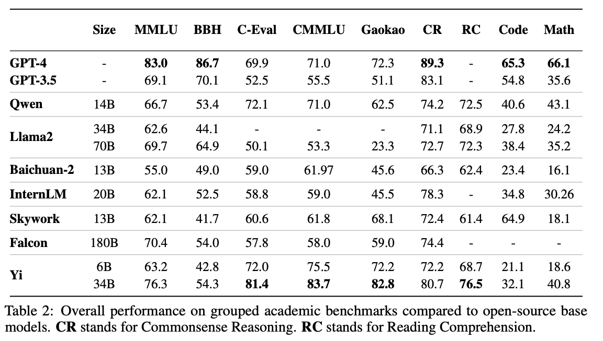
   

#### Discussions

   1. Gain from model scale
   
      Obviously, Yi-34B is greatly superior to Yi-6B.

      <mark>Larger model size leads to higher performance gain on Code and Math benchmarks, compared to benchmarks focusing on Commonsense Reasoning, Reading Comprehension, or Knowledge. </mark>

      

        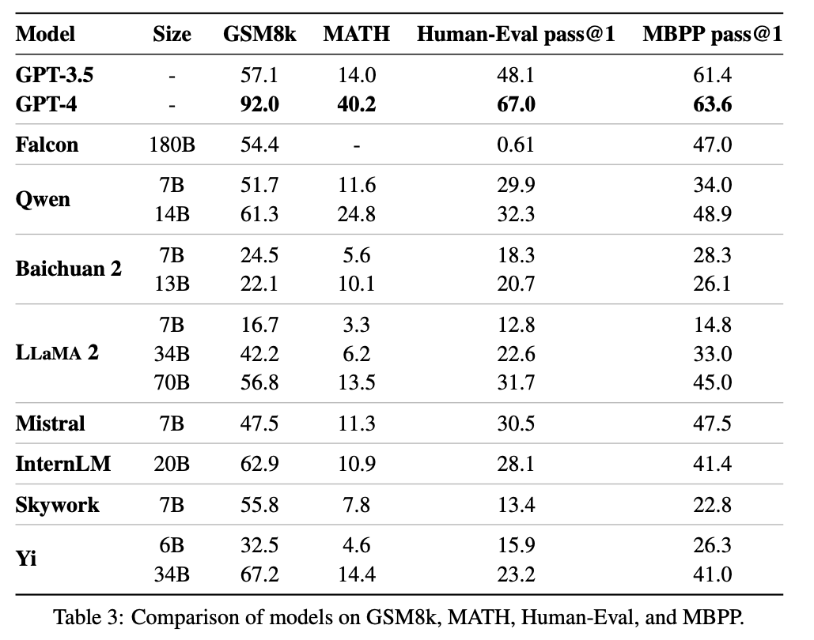
      

   2. Data Quality:

      

        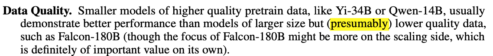
      

      <mark>Not quite sure if it's true.</mark>

   3. Gap between GPT-4 and Open-source LLMs

      <mark>A huge gap between GPT-4 and open-source models on reasoning-related benchmarks like BBH, code (HumanEval), and math (MATH).</mark>

### Final Takeaways

   * the full-stack development of the Yi language model family. 
   * Yi-34B achieves GPT-3.5 matching performance and is deployable (thank to the 4/8-bit quantization) on consumer-grade devices
   * Data quantity and quality: 
      1. training the model on a larger amount of data than the Chinchilla optimal delivers clear and consistent performance gain, which we highly recommend for all pretraining teams. 
      2. Our model is trained on 3.1T tokens, yet we belive with larger amount of data, we can continue improve the model performance (i.e., the model have not saturated at 3.1T); 
      3. when it comes to the pretraining data quality, we believe the most critical two factors are the source of the data (e.g., whether the text is produced for professional usage or for casual social media posting) and the details of the data cleaning (e.g., the strength of filtering and deduplication). 
      4. The key takeaways from the Yi finetuning procedure is to heavily iterate on a small amount of data (≤ 10K), case by case, over multiple iterations, directly by the machine learning engineer, and improved from real user feedback. 
   *  The reasoning capability, which we view as the core capability for real-world deployment of language models, is strongly correlated with model scale when the amount of pretraining data is fixed. 6. We believe that given our current results, continuing to scale up model parameters using thoroughly optimized data will lead to even stronger frontier models in our upcoming next versions.