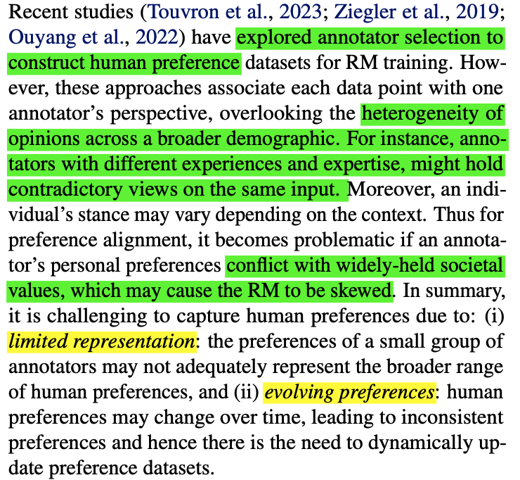
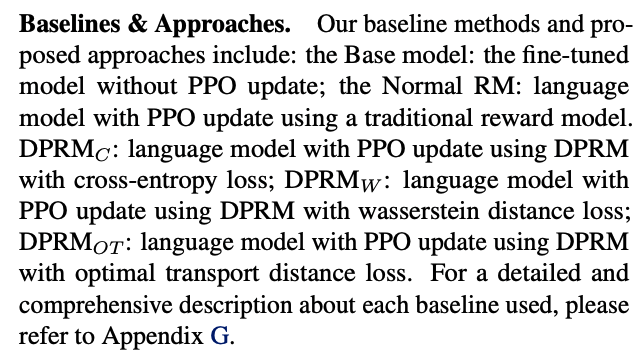
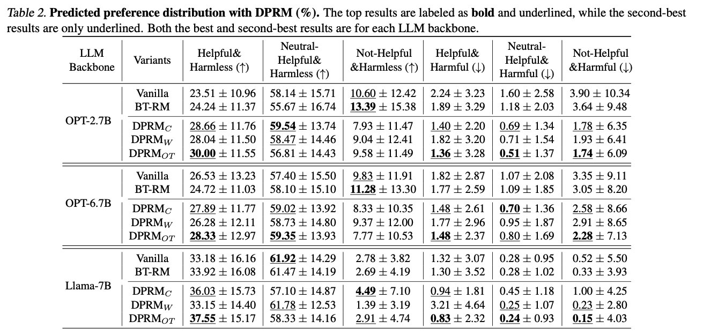

## Aligning Crowd Feedback via Distributional Preference Reward Modeling [[paper](https://arxiv.org/pdf/2402.09764.pdf)]

*Dexun Li, Cong Zhang, Kuicai Dong, Derrick Goh Xin Deik, Ruiming Tang, Yong Liu*

Huawei Noah’s Ark Lab

### Problem
  1. Limited representation
  2. Evolving preferences
   

    
   

### Method
 1. human preference distrbution, beta distribution
 
    

    A,B,... are generated from one comercial LLM with various simulated personas.`

    

    
    

    * Prior Distribution: $LLM_{API}$ directly outputs a distribution that captures a wide range of human perspectives.
    * Posterior Distribution: $LLM_{API}$ is instructed to emulate different human personas like "rigorous scientists", "impulsive teens", "eccentric artists", etc, and articulate their perfrences by selecting one of the six categories.
    * Label Smoothing: on posterior distriubtion, tempers absolute certainty by adjusting them towards near certainty with a marginal probability allocated to the next most likely label.

1. a novel reward model framework, Distributional Preference RM (DPRM)

   * Previously, use binary ranking label (chosen & rejected) for RM.
   * A direct idea is to use cross-entropy loss on the distributions:
   

   
   

   * However, such an idea results in equal distance between $[0.9, 0.1, 0, 0, 0, 0]$ with $[0.9, 0, 0.1, 0, 0, 0]$ or $[0.9, 0, 0, 0, 0, 0.1]$.
   * Need a ranking loss! Use optimal transport loss, which recognizes **geometry of label space**.
  
### Experiments
   1. Baselines
   

   
   

   2. Comparison results:
   

     
   
